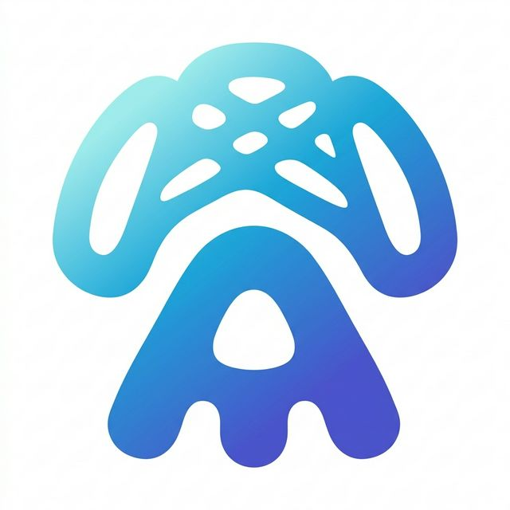

<p align="center">
  
</p>

<h1 align="center">Handy Translate</h1>

<p align="center">
  <strong>🌍 一款轻量级的 Windows 桌面划词翻译工具</strong>
</p>

<p align="center">
  基于 <a href="https://v3alpha.wails.io/">Wails v3</a> 构建 · Go + React · 打包体积仅 ~10MB
</p>

<p align="center">
  <a href="#功能特性">功能特性</a> •
  <a href="#效果展示">效果展示</a> •
  <a href="#快速开始">快速开始</a> •
  <a href="#配置说明">配置说明</a> •
  <a href="#开发指南">开发指南</a> •
  <a href="#项目架构">项目架构</a> •
  <a href="#致谢">致谢</a>
</p>

---

## ✨ 功能特性

### 🔤 翻译功能
- **划词翻译** — 鼠标选中文本，点击中键即刻翻译
- **截图 OCR 翻译** — 按 `Ctrl+Shift+F` 截取屏幕区域，自动识别文字并翻译
- **流式翻译** — 支持 DeepSeek / MiniMax 等 LLM 的流式输出，实时查看翻译结果
- **单词查询** — 自动检测单词，展示音标、词性、释义、例句的词典卡片

### 🧠 智能解释
- **多模板解释** — 选中文本后切换"解释"模式，使用 LLM 深度解释内容
- **自定义模板** — 内置「技术视角」「文学视角」模板，支持通过配置文件自定义
- **Markdown 渲染** — 解释结果支持完整 Markdown 格式展示

### 🔌 多翻译源
| 翻译源 | 普通翻译 | 流式翻译 | 流式解释 |
|--------|:--------:|:--------:|:--------:|
| 百度翻译 | ✅ | — | — |
| 有道翻译 | ✅ | — | — |
| 彩云小译 | ✅ | — | — |
| Google翻译 | ✅ | ✅ | ✅ |
| DeepSeek | ✅ | ✅ | ✅ |
| MiniMax  | ✅ | ✅ | ✅ |

### 💡 更多特性
- **窗口固定** — 工具栏可固定置顶，方便连续查看
- **TTS 语音播放** — 支持中英文发音，带内存缓存
- **翻译历史** — 自动保存翻译和解释记录
- **系统托盘** — 后台运行，托盘菜单快速操作
- **国际化** — 支持中英文界面
- **轻量打包** — 相比 Electron，Wails 构建产物仅 ~10MB

---

## 📸 效果展示

- 点击 **鼠标中键** 选中文本弹出翻译窗口
- 按 **Ctrl+Shift+F** 截图后 OCR 翻译


---

## 🚀 快速开始

### 环境要求

| 依赖 | 版本要求 | 说明 |
|------|---------|------|
| [Go](https://go.dev/dl/) | ≥ 1.25 | 后端运行时 |
| [Node.js](https://nodejs.org/) | ≥ 18 | 前端构建 |
| [Wails CLI](https://v3alpha.wails.io/getting-started/installation/) | v3.0.0-alpha.74 | 构建框架 |

> ⚠️ Wails v3 目前处于 alpha 阶段，安装请参考 [官方安装指南](https://v3alpha.wails.io/getting-started/installation/)

安装 Wails 后，验证环境：

```bash
wails3 show
```

### 安装步骤

**1. 克隆项目**

```bash
git clone https://github.com/byzze/handy-translate.git
cd handy-translate
```

**2. 配置翻译源**

```bash
# 复制配置模板
cp config.toml.bak config.toml
```

编辑 `config.toml`，填入你的翻译 API 密钥（详见 [配置说明](#配置说明)）。

**3. 运行**

```bash
# 开发模式（热重载）
wails3 dev

# 或者直接构建
wails3 build
```

**4. 使用**

- Windows 双击 `handy-translate.exe` 启动
- 选中文本 → 点击鼠标中键 → 翻译结果弹窗
- 按 `Ctrl+Shift+F` → 截图 → OCR → 翻译

---

## ⚙️ 配置说明

配置文件为项目根目录下的 `config.toml`，首次使用请从 `config.toml.bak` 复制。

### 完整配置示例

```toml
appname = 'handy-translate'
translate_way = 'deepseek'             # 当前翻译源：baidu / youdao / deepseek / minimax / caiyun / google
toolbar_mode = 'translate'             # 工具栏模式：translate / explain
toolbar_pinned = false                 # 工具栏是否固定

# ──────────────────────────────────────
# 快捷键配置
# ──────────────────────────────────────
[keyboards]
toolBar = ['center', '', '']           # 划词翻译：鼠标中键
screenshot = ['ctrl', 'shift', 'f']    # 截图翻译：Ctrl+Shift+F

# ──────────────────────────────────────
# 翻译源配置（填写对应的 API 密钥）
# ──────────────────────────────────────
[translate]

[translate.baidu]                      # https://fanyi-api.baidu.com/api/trans/product/apidoc
name = '百度翻译'
appID = ''                             # 百度翻译 APP ID
key = ''                               # 百度翻译密钥

[translate.youdao]                     # https://ai.youdao.com/DOCSIRMA/html/trans/api/wbfy/index.html
name = '有道翻译'
appID = ''                             # 有道应用 App Key
key = ''                               # 有道应用 App Secret

[translate.deepseek]                   # https://platform.deepseek.com/
name = 'DeepSeek'
appID = 'deepseek'
key = ''                               # DeepSeek API Key
base_url = ''                          # 可留空，使用默认地址
model = ''                             # 可留空，使用默认模型

[translate.minimax]                    # https://platform.minimaxi.com/
name = 'MiniMax'
appID = 'minimax'
key = ''                               # MiniMax API Key
base_url = 'https://api.minimaxi.com'
model = 'MiniMax-M2.7'

[translate.caiyun]                     # 彩云小译
name = '彩云小译'
appID = ''
key = ''                               # 彩云小译 Token

[translate.google]                     # https://aistudio.google.com/apikey
name = 'Google Gemini'
appID = 'google'
key = ''                               # Google AI API Key
base_url = ''                          # 可留空，使用默认 Gemini 地址
model = 'gemini-2.0-flash'             # 可选：gemini-2.0-flash / gemini-2.5-pro 等

# ──────────────────────────────────────
# 解释模板配置（LLM 解释模式使用）
# ──────────────────────────────────────
[explain_templates]
default_template = 'programmer'        # 默认模板 ID

[explain_templates.templates.programmer]
name = '技术视角'
description = '适合解释编程、技术相关术语'
template = """你是一名资深程序员...
术语：{{.text}}"""

[explain_templates.templates.academic]
name = '文学视角'
description = '适合解释文学词语'
template = """你是一位拥有极其丰富阅读经验的学者...
词语：{{.text}}"""

# ──────────────────────────────────────
# 历史记录配置
# ──────────────────────────────────────
[history]
enabled = true                         # 是否启用历史记录
storage_path = './data'                # 历史记录存储路径
```

### 翻译 API 申请指引

| 翻译源 | 申请地址 | 备注 |
|--------|---------|------|
| 百度翻译 | [百度翻译开放平台](https://fanyi-api.baidu.com/api/trans/product/apidoc) | 标准版免费 |
| 有道翻译 | [有道智云](https://ai.youdao.com/DOCSIRMA/html/trans/api/wbfy/index.html) | 新用户赠送体验金 |
| Google Gemini | [Google AI Studio](https://aistudio.google.com/apikey) | 支持流式翻译和解释 |
| DeepSeek | [DeepSeek Platform](https://platform.deepseek.com/) | 支持流式翻译和解释 |
| MiniMax | [MiniMax 海螺平台](https://platform.minimaxi.com/) | 支持流式翻译和解释 |

---

## 🛠️ 开发指南

### 项目技术栈

| 层 | 技术 | 说明 |
|----|------|------|
| **框架** | [Wails v3](https://v3alpha.wails.io/) | Go + Web 跨平台桌面框架 |
| **后端** | Go 1.25+ | 核心翻译逻辑、系统 API 调用 |
| **前端** | React 18 + Vite | 用户界面 |
| **UI 组件** | [NextUI](https://nextui.org/) | 现代 React UI 组件库 |
| **状态管理** | [Jotai](https://jotai.org/) | 原子化状态管理 |
| **国际化** | i18next | 多语言支持 |
| **OCR** | RapidOCR-json | 离线文字识别 |

### 常用命令

```bash
# 开发模式（前后端热重载）
wails3 dev

# 构建可执行文件
wails3 build

# 打包安装程序（生成到 dist 目录）
wails3 package
```

### OCR 模型

截图 OCR 功能依赖 `RapidOCR-json.exe` 和 `models/` 目录下的模型文件（约 75MB）。

---

## 🏗️ 项目架构

```
handy-translate/
├── main.go                      # 程序入口，依赖注入组装
├── config/                      # 配置管理（TOML 解析）
├── internal/                    # 内部核心逻辑
│   ├── app/                     # 应用核心（事件注册、绑定、状态管理）
│   │   ├── app.go               # Application 核心结构体
│   │   ├── binding.go           # Wails 前端绑定适配器
│   │   ├── state.go             # 并发安全的应用状态
│   │   └── screenshot.go        # 截图 → OCR → 翻译 流程
│   ├── service/                 # 业务服务层
│   │   ├── translator.go        # 翻译门面（Facade 模式）
│   │   ├── ocr.go               # OCR 服务封装
│   │   └── word_cache.go        # 单词查询缓存
│   ├── translate/               # 翻译抽象层
│   │   ├── provider.go          # Provider/StreamProvider 接口（策略模式）
│   │   ├── registry.go          # 翻译服务注册表（注册表模式）
│   │   └── adapters.go          # 旧 → 新接口适配器
│   ├── event/                   # 事件总线（观察者模式）
│   └── window/                  # 窗口管理器
├── translate_service/           # 各翻译源实现
│   ├── baidu/                   # 百度翻译
│   ├── youdao/                  # 有道翻译
│   ├── caiyun/                  # 彩云小译
│   ├── deepseek/                # DeepSeek（支持流式）
│   └── minimax/                 # MiniMax（支持流式）
├── window/                      # 窗口 UI 配置
│   ├── toolbar/                 # 划词工具栏窗口
│   ├── translate/               # 翻译主窗口
│   └── screenshot/              # 截图窗口
├── os_api/                      # 操作系统 API
│   └── windows/                 # Windows 钩子（鼠标/键盘）
├── history/                     # 翻译历史记录
├── logger/                      # 结构化日志工具
├── frontend/                    # React 前端
│   └── src/
│       ├── window/              # 各窗口 React 组件
│       │   ├── ToolBar/         # 划词工具栏 UI
│       │   ├── Translate/       # 翻译主界面
│       │   └── Screenshot/      # 截图选区 UI
│       ├── hooks/               # 自定义 Hooks
│       └── services/            # 前端服务（TTS 等）
└── models/                      # OCR 模型文件
```

### 设计模式

项目采用了多种经典设计模式保证代码质量：

| 模式 | 应用位置 | 说明 |
|------|---------|------|
| **依赖注入** | `main.go` | 所有服务在入口处组装，避免硬编码依赖 |
| **策略模式** | `Provider` 接口 | 翻译源可插拔替换，统一调用方式 |
| **观察者模式** | `EventBus` | 前后端事件解耦通信 |
| **门面模式** | `Translator` | 统一翻译/解释/缓存/历史的复杂逻辑 |
| **适配器模式** | `Binding` / `adapters.go` | 前端绑定适配 + 旧接口兼容层 |
| **注册表模式** | `Registry` | 动态注册和获取翻译提供者 |

---

## 🙏 致谢

本项目受到以下优秀开源项目的启发和帮助：

- [Wails](https://v3alpha.wails.io/) — Go + Web 跨平台桌面应用框架
- [NextUI](https://nextui.org/) — 现代化 React UI 组件库
- [pot-desktop](https://github.com/pot-app/pot-desktop) — Rust 开发的跨平台翻译工具
- [go-qoq](https://github.com/duolabmeng6/go-qoq) — Wails 开发的翻译工具

---

## 📄 许可协议

本项目仅供学习和个人使用。

---

> 🎯 欢迎提出问题和建议，我会积极跟进！
